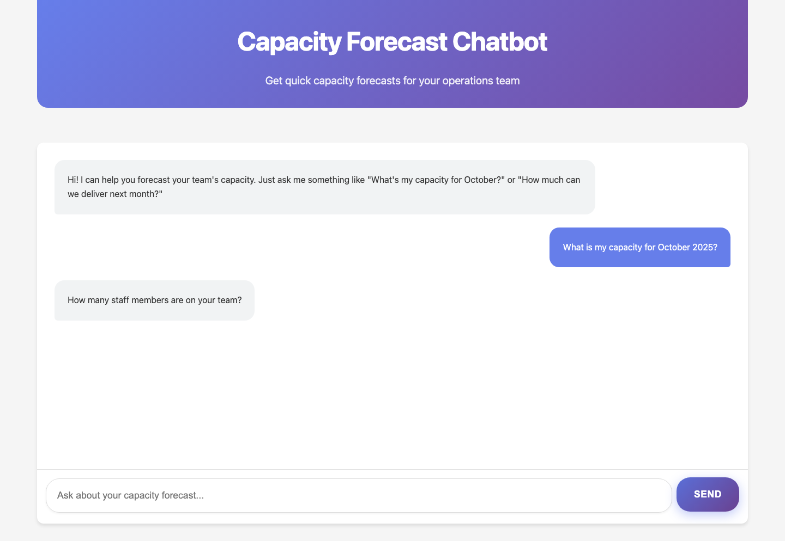
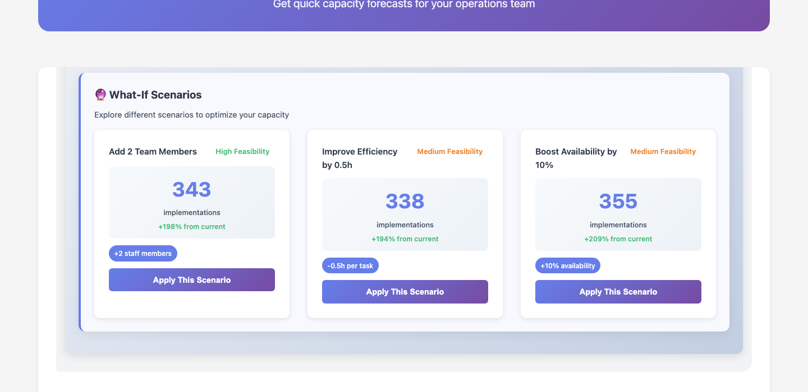
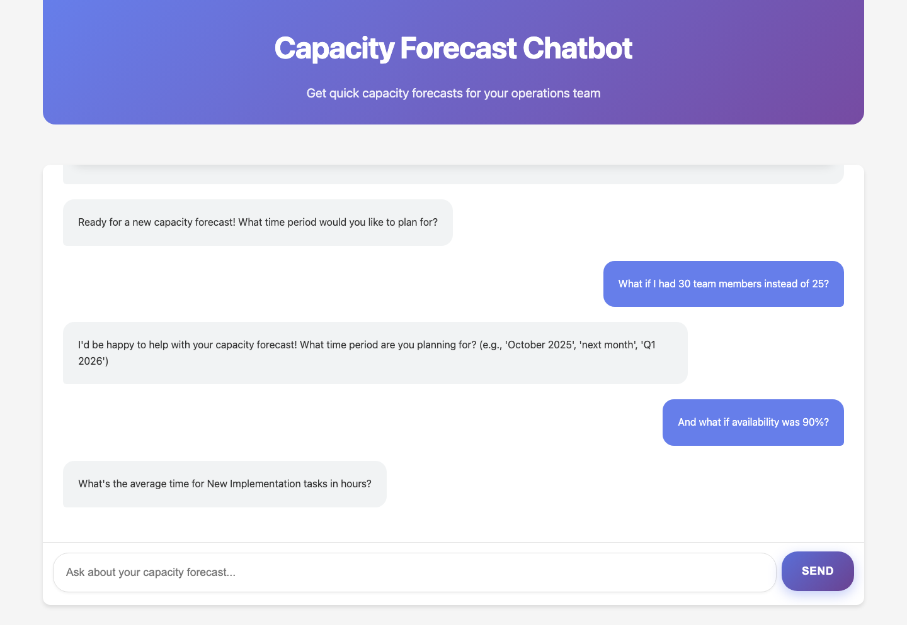

# Capacity Forecast Chatbot

[](https://opensource.org/licenses/MIT)
[](https://www.javascript.com/)
[](https://www.w3.org/Style/CSS/)

A smart web-based chatbot that helps Operations Leads quickly forecast production capacity for their teams using natural language conversations.



## Features

- 🤖 **Natural Language Interface** - Ask questions like "What's my capacity for October?"
- 📊 **Visual Dashboard** - Interactive results with 4-column metrics layout
- 📱 **Responsive Design** - Works seamlessly on desktop and mobile
- 📄 **PDF Export** - Professional reports with consistent dashboard layout
- 🔄 **Multi-Scenario Support** - Calculate and compare different forecasts
- ⚡ **Real-time Calculations** - Instant capacity forecasting results
- 🎯 **Professional Alignment** - Clean calculation breakdown with proper text alignment

## Built With

- **Frontend**: HTML5, CSS3, JavaScript (ES6+)
- **PDF Generation**: jsPDF, html2canvas
- **Testing**: Playwright
- **AI Integration**: Google Gemini API (optional)

## Getting Started

### Prerequisites

- Modern web browser (Chrome, Firefox, Safari, Edge)
- Python 3.x (for local server)
- Node.js (for testing, optional)

### Installation

Clone the repository:
```bash
git clone https://github.com/your-username/capacity-forecast-chatbot.git
cd capacity-forecast-chatbot
```

Start the application:
```bash
python3 -m http.server 8080
```

Open your browser and navigate to:
```
http://localhost:8080
```

## Usage

### Basic Conversation

Start with any capacity-related question:

```
"What's my capacity for October 2025 with 25 team members?"
```

The bot will guide you through collecting:
- **Time Window**: When you want the forecast for
- **Staff Count**: Number of team members
- **Average Implementation Time**: Hours per task
- **Availability Ratio**: Percentage of productive time (e.g., 85%)

### Example Workflow

| Step | User Input | Bot Response |
|------|------------|--------------|
| 1 | "What's my capacity for next month?" | "How many staff members are on your team?" |
| 2 | "15" | "What's the average implementation time per task?" |
| 3 | "3 hours" | "What's your expected availability ratio?" |
| 4 | "85%" | *Displays interactive dashboard* |

### Dashboard Features

The result displays as a comprehensive dashboard with:

- **4-Column Metrics**: Team Members, Working Days, Availability, Available Hours
- **Work Type Breakdown**: New Implementation (65%) vs Update Requests (35%)
- **Calculation Details**: Step-by-step math with professional alignment
- **Action Buttons**: Reset calculations and download PDF reports

## Available Scripts

| Script | Description |
|--------|-------------|
| `python3 -m http.server 8080` | Start development server |
| `npm test` | Run Playwright tests |
| `npm run test:headed` | Run tests with visible browser |
| `npm run test:ui` | Interactive test interface |
| `npx playwright test tests/screenshots.spec.js` | Generate documentation screenshots |

## Testing

The app includes comprehensive end-to-end testing:

```bash
# Install test dependencies
npm install

# Run all tests
npm test

# Run specific test suites
npx playwright test tests/capacity-forecast.spec.js
npx playwright test tests/pdf-test.spec.js
```

**Test Coverage:**
- ✅ Cross-browser compatibility (Chromium, Firefox, WebKit)
- ✅ Complete forecasting workflow
- ✅ PDF generation functionality
- ✅ Responsive design validation
- ✅ Interactive features and calculations

## Calculation Formula

The system allocates capacity between two work types:

```
Available Hours = [Working Days × 8 hours × Staff Count] × Availability Ratio

New Implementation Hours = Available Hours × 65%
Update Request Hours = Available Hours × 35%

New Implementation Tasks = New Implementation Hours ÷ Avg Implementation Time
```

Where working days exclude weekends (Monday-Friday only).

## AI Features (Optional)

Enable smart insights with Google Gemini API:

1. **Get API Key**: Visit [Google AI Studio](https://makersuite.google.com/app/apikey)
2. **Configure**: Type `set api key YOUR_API_KEY` in the chat
3. **Ask AI Questions**: "How does this compare to industry standards?"

**AI Capabilities:**
- Smart capacity insights and recommendations
- Industry benchmarking comparisons
- Optimization suggestions
- Risk analysis

## Browser Compatibility

| Browser | Supported Versions |
|---------|-------------------|
| Chrome | 90+ |
| Firefox | 88+ |
| Safari | 14+ |
| Edge | 90+ |

## Project Structure

```
capacity-forecast-chatbot/
├── index.html              # Main application
├── style.css               # Styles and responsive design
├── script.js               # Core chatbot logic
├── jspdf.min.js           # PDF generation library
├── screenshots/            # Documentation images
├── tests/                  # Playwright test suites
├── playwright.config.js    # Test configuration
└── README.md              # This file
```

## Screenshots

### Dashboard Report


### What-If Scenarios


## Contributing

1. Fork the repository
2. Create a feature branch (`git checkout -b feature/amazing-feature`)
3. Commit your changes (`git commit -m 'Add amazing feature'`)
4. Push to the branch (`git push origin feature/amazing-feature`)
5. Open a Pull Request

## License

This project is licensed under the MIT License - see the [LICENSE](LICENSE) file for details.

## Credits

Built with ❤️ for Operations Teams who need quick, reliable capacity forecasting.

---

**Need help?** Open an issue or contact the development team.